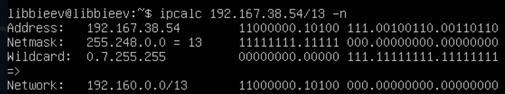
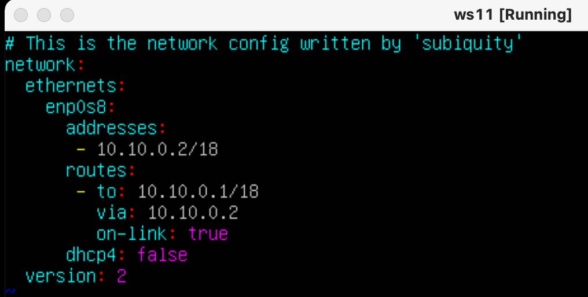
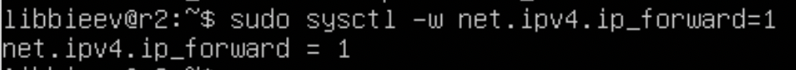
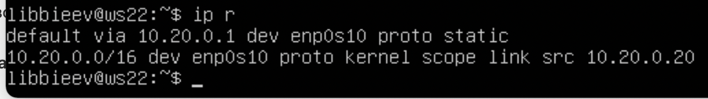
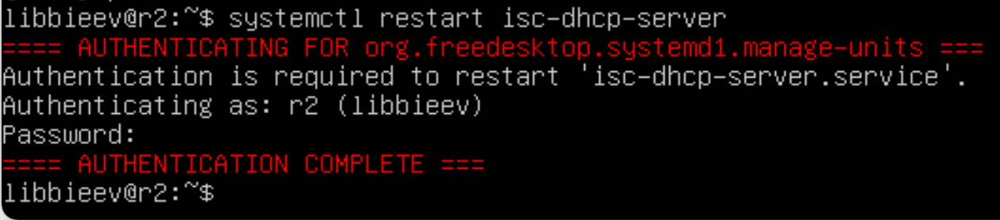

## Part 1. Инструмент ipcalc
### 1.1. Сети и маски
+ Адрес сети 192.167.38.54/13 (указан в поле *Network*)

+ Перевод маски 255.255.255.0 в префиксную и двоичную запись. Префиксная - /24, двоичная - на скриншоте.

+ /15 в обычную и двоичную

+ 11111111.11111111.11111111.11110000 в обычную и префиксную. Обычная - 256.256.256.240, префиксная - /28. Проверка на скриншоте.

### 1.2. localhost
+ *"Определить и записать в отчёт, можно ли обратиться к приложению, работающему на localhost, со следующими IP: 194.34.23.100, 127.0.0.2, 127.1.0.1, 128.0.0.1."*  
...  
Localhost определяется диапазоном адресов 127.0.0.0 — 127.255.255.255, следовательно:  
194.34.23.100 - нельзя,  
127.0.0.2 - можно,  
127.1.0.1 - можно,  
128.0.0.1 - нельзя.  

### 1.3. Диапазоны и сегменты сетей
+ *"какие из перечисленных IP можно использовать в качестве публичного, а какие только в качестве частных: 10.0.0.45, 134.43.0.2, 192.168.4.2, 172.20.250.4, 172.0.2.1, 192.172.0.1, 172.68.0.2, 172.16.255.255, 10.10.10.10, 192.169.168.1"*  
...   
Для локальных адресов определены диапазоны 10.0.0.0 — 10.255.255.255 (10.0.0.0/8), 172.16.0.0 — 172.31.255.255 (172.16.0.0/12), 192.168.0.0 — 192.168.255.255 (192.168.0.0/16), 127.0.0.0 — 127.255.255.255, следовательно:  
10.0.0.45 - частный,  
134.43.0.2 - публичный,  
192.168.4.2 - частный,  
172.20.250.4 - частный,  
172.0.2.1 - публичный,  
192.172.0.1 - публичный,  
172.68.0.2 - публичный,  
172.16.255.255 - частный,  
10.10.10.10 - частный,  
192.169.168.1 - публичный.  

+ *"какие из перечисленных IP адресов шлюза возможны у сети 10.10.0.0/18: 10.0.0.1, 10.10.0.2, 10.10.10.10, 10.10.100.1, 10.10.1.255"*  
...  

Из вывода команды ipcalc мы видим, что в данной сети IP-адреса могут принимать значение от 10.10.0.1 до 10.10.63.254. Следовательно:  
10.0.0.1 - невозможен,   
10.10.0.2 - возможен,  
10.10.10.10 - возможен,  
10.10.100.1 - невозможен,  
10.10.1.255 - возможен.  

## Part 2. Статическая маршрутизация между двумя машинами
+ С помощью команды ip a посмотреть существующие сетевые интерфейсы.  
+ ws1:  

+ ws2:  
  

+ Описать сетевой интерфейс, соответствующий внутренней сети, на обеих машинах и задать следующие адреса и маски: 
+ ws1 - 192.168.100.10, маска /16

+ ws2 - 172.24.116.8, маска /12  
  

+ Выполнить команду netplan apply для перезапуска сервиса сети.   
+ ws1:

+ ws2: 

### 2.1. Добавление статического маршрута вручную
+ Добавить статический маршрут от одной машины до другой и обратно при помощи команды вида ip r add. Пропинговать соединение между машинами.  
+ ws1:

+ ws2:

### 2.2. Добавление статического маршрута с сохранением
+ Добавить статический маршрут от одной машины до другой с помощью файла etc/netplan/00-installer-config.yaml. 
+ ws1:

+ ws2:

+ Пропинговать соединение между машинами.
+ ws1:

+ ws2:  

## Part 3. Утилита iperf3
### 3.1. Скорость соединения
+ *Перевести и записать в отчёт: 8 Mbps в MB/s, 100 MB/s в Kbps, 1 Gbps в Mbps.*  
8 Mbps = 1 MB/s  
100 MB/s = 100000 Kbps  
1 Gbps = 1000 Mbps  

### 3.2. Утилита iperf3
+ Измерить скорость соединения между ws1 и ws2.
+ Запускаем сервер на ws1:

+ Подключаемся к серверу на ws2:

## Part 4. Сетевой экран
### 4.1. Утилита iptables
+ firewall.sh на ws1:

+ firewall.sh на ws2:

+ Запуск скрипта на ws1:

+ Запуск скрипта на ws2:

+ *В отчёте описать разницу между стратегиями, применёнными в первом и втором файлах.*  
В первом случае мы сперва запретили пингование машины, а потом его разрешили, а во втором случае - наоборот.

### 4.2. Утилита nmap
+ Командой ping найти машину, которая не "пингуется".

+ Утилитой nmap показать, что хост машины запущен.

## Part 5. Статическая маршрутизация сети
### 5.1. Настройка адресов машин
+ *Настроить конфигурации машин в etc/netplan/00-installer-config.yaml согласно сети на рисунке.*
+ ws11  

+ r1  

+ r2  
 
+ ws21  

+ ws22  

+ *Перезапустить сервис сети. Если ошибок нет, то командой ip -4 a проверить, что адрес машины задан верно.*
+ ws11  

+ r1  

+ r2  

+ ws21  

+ ws22  

+ *Также пропинговать ws22 с ws21.*
  
+ *Аналогично пропинговать r1 с ws11.*  

### 5.2. Включение переадресации IP-адресов.
+ *Для включения переадресации IP, выполните команду на роутерах:*
*sysctl -w net.ipv4.ip_forward=1*
+ r1  

+ r2  

+ *Откройте файл /etc/sysctl.conf и добавьте в него следующую строку:*
*net.ipv4.ip_forward = 1*
+ r1  

+ r2  

### 5.3. Установка маршрута по-умолчанию
+ *Настроить маршрут по-умолчанию (шлюз) для рабочих станций. Для этого добавить gateway4 [ip роутера] в файле конфигураций*
+ ws11  

+ ws21  

+ ws22  

+ *Вызвать ip r и показать, что добавился маршрут в таблицу маршрутизации*
+ ws11  

+ ws21  

+ ws22  

+ *Пропинговать с ws11 роутер r2 и показать на r2, что пинг доходит. Для этого использовать команду:*
*tcpdump -tn -i eth1*
+ 

### 5.4. Добавление статических маршрутов
+ *Добавить в роутеры r1 и r2 статические маршруты в файле конфигураций.*
+ r1  

+ r2  

+ *Вызвать ip r и показать таблицы с маршрутами на обоих роутерах.*
+ r1  

+ r2  

+ *Запустить команды на ws11:*
*ip r list 10.10.0.0/[маска сети] и ip r list 0.0.0.0/0*

### 5.5. Построение списка маршрутизаторов
+ *Запустить на r1 команду дампа:*
*tcpdump -tnv -i eth0*  
(я, соответственно, использовал команду tcpdump -tnv -i enp0s8 и добавил к ней команду | less -N, чтобы прочитать весь вывод)  
+ начало вывода  

+ конец вывода  

+ *При помощи утилиты traceroute построить список маршрутизаторов на пути от ws11 до ws21*  

### 5.6. Использование протокола ICMP при маршрутизации
+ *Запустить на r1 перехват сетевого трафика, проходящего через eth0 с помощью команды:*
*tcpdump -n -i eth0 icmp*  

+ *Пропинговать с ws11 несуществующий IP (например, 10.30.0.111) с помощью команды:*
*ping -c 1 10.30.0.111*  

## Part 6. Динамическая настройка IP с помощью DHCP
+ *Для r2 настроить в файле /etc/dhcp/dhcpd.conf конфигурацию службы DHCP:*  
+ *1) указать адрес маршрутизатора по-умолчанию, DNS-сервер и адрес внутренней сети.*  

+ *2) в файле resolv.conf прописать nameserver 8.8.8.8.*  

+ *Перезагрузить службу DHCP командой systemctl restart isc-dhcp-server.*  

+ *Машину ws21 перезагрузить при помощи reboot и через ip a показать, что она получила адрес.*  

+ *Также пропинговать ws22 с ws21.*  

+ *Указать MAC адрес у ws11, для этого в etc/netplan/00-installer-config.yaml надо добавить строки: macaddress: 10:10:10:10:10:BA, dhcp4: true*  

+ *Для r1 настроить аналогично r2, но сделать выдачу адресов с жесткой привязкой к MAC-адресу (ws11). Провести аналогичные тесты*  
+ Меняем на r1 файл конфигурации DHCP  

+ Перезапускаем эту службу  

+ Перезагружаем ws11 и убеждаемся, что она получила нужный mac-адрес.  

+ Пингуем ws11 с машины r1  

+ Пингуем ws22 с машины ws11  

+ *Запросить с ws21 обновление ip адреса.*
+ Просматриваем текущий IP с помощью команды ip a.  

+ Командой sudo dhclient -r enp0s10 удаляем имеющийся IP адрес для данного интерфейса.  

+ Командой sudo dhclient enp0s10 получаем новый IP.  

+ (мы воспользовались опциями release/renew dhcp-сервера).

## Part 7. NAT
+ *В файле /etc/apache2/ports.conf на ws22 и r1 изменить строку Listen 80 на Listen 0.0.0.0:80, то есть сделать сервер Apache2 общедоступным*

+ *Запустить веб-сервер Apache командой service apache2 start на ws22 и r1*
+ ws22

+ r1

+ *Добавить в фаервол, созданный по аналогии с фаерволом из Части 4, на r2 следующие правила:*  
*1) Удаление правил в таблице filter - iptables -F*  
*2) Удаление правил в таблице "NAT" - iptables -F -t nat*  
*3) Отбрасывать все маршрутизируемые пакеты - iptables --policy FORWARD DROP*  
Создаём файл /etc/firewall.sh  

+ *Запускать файл также, как в Части 4*  

+ *Проверить соединение между ws22 и r1 командой ping*  

+ *Добавить в файл ещё одно правило:*  
*4) Разрешить маршрутизацию всех пакетов протокола ICMP*  

+ *Проверить соединение между ws22 и r1 командой ping*  

+ *Добавить в файл ещё два правила:*  
*5) Включить SNAT, а именно маскирование всех локальных ip из локальной сети, находящейся за r2 (по обозначениям из Части 5 - сеть 10.20.0.0)*  
*6) Включить DNAT на 8080 порт машины r2 и добавить к веб-серверу Apache, запущенному на ws22, доступ извне сети*  
+ 
+ *Проверить соединение по TCP для SNAT, для этого с ws22 подключиться к серверу Apache на r1 командой:*  
*telnet [адрес] [порт]*  

+ *Проверить соединение по TCP для DNAT, для этого с r1 подключиться к серверу Apache на ws22 командой telnet (обращаться по адресу r2 и порту 8080)*  

## Part 8. Дополнительно. Знакомство с SSH Tunnels
+ *Запустить веб-сервер Apache на ws22 только на localhost (то есть не изменять файл /etc/apache2/ports.conf или, если был изменен ранее, вернуть строку Listen 80)*  

+ Перезапускаем апач  

+ *Воспользоваться Local TCP forwarding с ws21 до ws22, чтобы получить доступ к веб-серверу на ws22 с ws21*  

+ *Воспользоваться Remote TCP forwarding c ws11 до ws22, чтобы получить доступ к веб-серверу на ws22 с ws11*  
